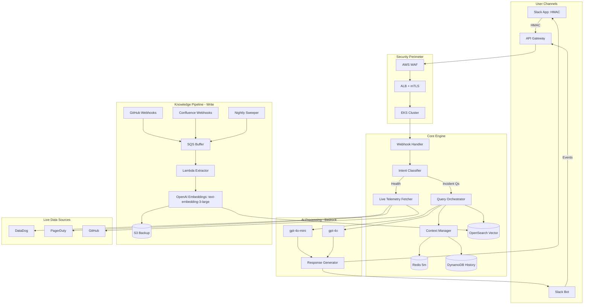
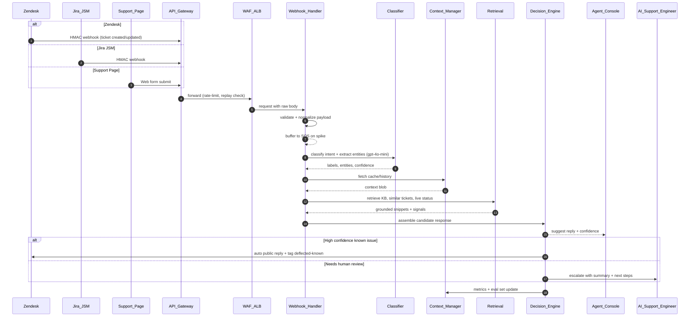

# Synapse — Presentation

> Support Ticket Deflection System — RAG + Guardrails, Safer Automation

---

## Agenda
- Problem & stakes
- Ticket deflection system
- Architecture at a glance
- Guardrails & control loops
- EKS, CI/CD, rollout (incl. support)
- Observability & performance
- Impact, metrics, stakeholders, roadmap
- Q&A

---

## Problem & Stakes
- **On-call pain:** high noise, long context-building, tool-hopping during multiple high pririty tickets/incidents
- **Goal:** reduce MTTR and ticket volume via trustworthy, production-safe AI
- **Constraint:** security, cost, and reliability

---

## Support Ticketing Deflection System
- **Entry points:** Zendesk, Jira/JSM, OpenAI Support page, and email/web widget → queue → webhook to bot
- **LLM steps:** classify intent, extract entities (product, error, tenant), summarize ticket
- **Retrieval:** ground with KB/runbooks; detect “known issue” banners; propose resolution
- **Deflection paths:** instant answers, guided flows/forms, similar tickets; escalate with summary if confidence low
- **Feedback loop:** thumbs up/down → eval dataset → weekly prompt/tool retraining

---

## Architecture at a Glance

Key decisions
- RAG: split read (ORCH→OpenSearch) vs write (pipeline→OpenSearch)
- Cost control: 60% gpt-4o-mini / 40% gpt-4o routing; cache + circuit breakers
- Spike safety: SQS buffers bursts; token bucket rate limiting on APIs

---

## Ticket Flow: Zendesk/Jira Service Management → Resolution

- Intake (Zendesk/JSM → API Gateway)
  - Source sends HMAC-signed webhook; rate limits per source; replay protection
  - Normalize payload → {org_id, user_id, product, endpoint, sdk_version, region, severity, attachments, correlation_id}
- Security perimeter (WAF → ALB → EKS)
  - Raw body preserved for signature verification; header canonicalization
- Webhook Handler (EKS)
  - Validate and transform; attach source metadata; buffer to SQS on spikes
- Intent classification (gpt-4o-mini)
  - Classify (billing/auth/latency/SDK), extract entities; fall back to rules on very low confidence
- Context manager (Redis/DynamoDB)
  - Fetch cached context (Redis 5m), store conversation history (DynamoDB), dedupe via idempotency key
- Retrieval (OpenSearch + live fetches)
  - Vector search over KB/runbooks/release notes; fetch live status/metrics/incidents as needed
- Candidate response (OpenAI routing)
  - Route simple to gpt-4o-mini; complex to gpt-4o; return structured JSON with steps, refs, confidence
- Decision engine (deflect vs escalate)
  - If known-issue + high confidence + safe topic → post public reply in Zendesk/JSM, tag deflected-known, add internal note
  - Else → assign to AI Support Engineer queue with summary, repro checklist, next-step buttons
- Agent assist (console/Slack)
  - Sidebar suggestions, macros; Slack slash commands to fetch/attach diagnostics to ticket
- Audit & safety
  - Structured logs with correlation_id; PII redaction; timeouts, retries, rate limits
- Metrics emitted
  - FCR, deflection success/fail, override rate, time-to-first-response, resolution time, backlog age, cost/ticket
- KB & eval updates
  - On resolution, update KB/runbook gaps; ingest to vector index; add Q/A to eval set
- Closure & digest
  - CSAT request and reason codes; weekly digest to Product/Eng with top topics and automation backlog
---

## Guardrails & Control Loops
- Policy tiers: read-only by default; action paths require explicit confirmation and safety checks
- SLO gates: canary windows, burn-rate alarms, health windows post-change
- Fallbacks: degrade gracefully — no silent failures
- Deterministic wrappers: retries, idempotency keys, bounded concurrency

Control-loop framing
- Sense: metrics/logs/traces, recent deploys, similar incidents
- Compare: error budgets, SLO targets, risk thresholds
- Act: suggest next step, or gated automation with rollbacks

---

## Assumptions & Alternatives
Assumptions
- Support platform exposes webhooks/APIs; KB exists but is fragmented
- Acceptable deflection target: 15–30% for L1 known-issues; human-in-loop required (PCR required)

Alternatives considered
- Rules-only triage (cheap, brittle) vs LLM classification + RAG (scalable, higher precision)
- “Copilot only” responses vs gated automation for simple actions (status lookups, resets)

---

## EKS, CI/CD, Rollout
- EKS Multi-AZ: autoscaling via Karpenter/Cluster Autoscaler; mTLS between services
- CI/CD: GitHub Actions → Bazel → container image → ArgoCD progressive delivery
- Feature flags: staged enablement by team/service; kill-switches
- Rollout plan: internal champions → single team → region → global

---

## Phased Rollout & Metrics (Support)
Phases
- Phase 0: Instrument baseline (deflection, FCR, TTR, backlog age, CSAT)
- Phase 1: Read-only assistant in agent console; auto-suggested replies; opt-in feedback
- Phase 2: End-user deflection on portal with confidence gates and safe topics
- Phase 3: Limited automation (e.g., status lookups) behind feature flags and audits

Success metrics
- Deflection rate, FCR, time-to-first-response, resolution time, CSAT, agent handle time
- Quality guardrails: false-positive deflections, override rate, hallucination incidents
- Scalability: QPS, cost/ticket, concurrency headroom, backlog distribution

Validation steps
- Offline eval set from historical tickets → acceptance thresholds
- Live shadow A/B in one queue → expand by cohort
- Red-team tests; guardrail monitors with auto-disable on breach

---

## Observability & Performance
- Tracing: end-to-end traces per user query (bot → ORCH → vendors)
- Metrics: p95 latency, deflection rate, FCR, time-to-first-response, backlog age, resolver accuracy, cost/query
- Logging: structured, redaction by policy, correlation IDs
- Profiling: eBPF/Pyroscope harness for CPU hot spots and tail latencies
- Performance playbook: pre-warm connections, parallel fetches, cache tiers

---

## Security by Default
- HMAC validation at ingress; strict header casing; raw-body signature
- Mutual TLS between internal services (certs via ACM)
- Secrets Manager with local cache TTLs; rotation schedules per secret class
- Rate limiting per vendor SLA; circuit breakers and timeouts

---

## Stakeholders & Governance
- Product & Support leadership: targets, deflection thresholds, CSAT safeguards
- Platform/SRE: reliability, cost, performance budgets, rollout gates
- Data Privacy/Legal/Sec: PII handling, retention, audit trails, model/data boundaries
- Change governance: RFCs, feature flags, staged rollouts, post-launch reviews

---

## Impact, Risks, Roadmap
Impact (targets and examples)
- MTTR: -20–35% in P1/P2 via faster context
- Ticket deflection: 15–30% of “known issue” L1 tickets
- Cost: model routing + cache lowers spend ~20% vs naive Sonnet-only

Risks & mitigations
- Hallucination: retrieval-augmented grounding + confidence bands; never automate irreversible actions
- Vendor limits: token bucket + SQS buffering; stale-but-acceptable caches
- Security drift: rotation audits, mTLS everywhere, IAM least privilege

Roadmap
- Toolformer-style action plugins with dry-run diffs
- Broader channel support; incident timeline summarizer
- Offline eval harness and regression suite in CI

## My notes
## User Operations: AI Support Engineer — Ticket Workflow 
- **Channel intake:** Slack, Zendesk, Jira/JSM, or OpenAI Support page ticket arrives with org ID, endpoint, error code, severity
- **Auto-triage (gpt-4o-mini):** classify intent (billing/auth/latency), extract entities (product, endpoint, SDK, region), set priority and owner queue
- **Grounding:** retrieve KB/runbooks, release notes, incident status, similar tickets; surface known-issue banner if matched
- **Candidate reply:** propose steps with references (docs, runbook anchors); show confidence, require human send for medium/low
- **Decision gates:**
  - **High-confidence known issue →** deflect with one-click reply, log artifacts, tag “deflected-known”
  - **Else →** escalate to AI Support Engineer with prefilled ticket fields and suggested next actions
- **Human investigation assist:** generate repro checklist, request IDs, minimal code sample; suggest SDK/version checks and quick diagnostics
- **Partner loop:** if bug suspected, open issue in tracker with auto-filled impact, severity, repro, logs; link Slack thread and customer ticket
- **Closure & learning:** update KB/runbook gaps, add to eval dataset, tag topic for future automation; notify product/eng in weekly digest
- **Metrics captured:** FCR, deflection, time-to-first-response, resolution time, backlog age, CSAT; override rate and hallucination incidents

---

## Staff Proposal: Multi-Channel Intake Changes (Zendesk, Jira/JSM, OpenAI Support)
- **Unified intake gateway:** standardize webhooks from Zendesk, Jira/JSM, and Support page to API Gateway → normalized ticket schema
- **Normalization schema:** require org_id, user_id, product, endpoint, SDK/version, region, severity, reproduction artifacts, correlation_id
- **Source auth:** per-source HMAC secrets, replay protection, rate limits; source label preserved for reporting and routing
- **Smart triage:** gpt-4o-mini for classification/entity extraction; policy thresholds for auto-deflect vs. human-in-loop
- **Known-issue banners:** dynamic banners on Support page and agent console; driven by releases/incidents and KB updates
- **Slack integration:** slash command to create/attach tickets; thread-to-ticket linking; on-call handoff templates
- **Quality loop:** offline evals from historical tickets; shadow A/B by source; weekly error analysis to tune prompts/tools
- **Dashboards:** deflection, FCR, TFR, backlog age, CSAT, cost/ticket by source; failure modes and override rates
- **Rollout:** Phase 1 Zendesk (agents only) → Phase 2 JSM → Phase 3 Support page end-user deflection; feature flags and auto-disable on breach

End-to-end flow (what happens)
Unified intake gateway
Standardize Zendesk/JSM/Support webhooks → API Gateway → normalized schema.
Security perimeter
WAF/ALB forward raw body for signature validation.
Webhook handler
Validate, normalize, enrich with source metadata; buffer to SQS during spikes.
Intent classification
gpt-4o-mini classifies (billing/auth/latency/SDK) and extracts entities (product, endpoint, SDK, region).
Context management
Redis cache for hot context (5m), DynamoDB for conversation history and idempotency.
Retrieval grounding
OpenSearch over KB/runbooks/release notes; live status/metrics/incidents fetched as needed.
Candidate response generation
Route simple to gpt-4o-mini, complex to gpt-4o; return structured steps, references, confidence.
Decision engine
High-confidence known issue + safe topic → auto public reply, tag “deflected-known”; else escalate with a prefilled summary and next steps.
Agent assist
Sidebar suggestions and macros; Slack slash commands to attach diagnostics.
Audit & safety
Structured logs, PII redaction, timeouts/retries/rate limits, correlation IDs.
Metrics & learning
Emit FCR, TFR, resolution time, backlog age, CSAT, override rate, cost/ticket; update KB/eval set; weekly digest to Product/Eng.
Why each safeguard is needed
HMAC signatures
Proves the ticket event came from Zendesk/JSM/Support; prevents forged webhooks.
Replay protection
Stops duplicate processing when sources retry deliveries (network flaps/backoff). Prevents double tickets or repeated public replies.
Rate limits + SQS buffering
Smooths traffic spikes (incident storms). Avoids 429s and dropped events; preserves ordering best-effort.
Normalized schema
One contract across sources (org_id, endpoint, sdk_version, severity, etc.). Reduces brittle per-source parsing and speeds feature delivery.
Idempotency keys
Ensures “exactly-once effect” for create/update flows even if the same event is delivered multiple times.
Retrieval grounding (RAG)
Reduces hallucinations; ties answers to canonical KB/runbooks/release notes.
Confidence thresholds + safe-topic gating
Automates only when risk is low; routes ambiguous/novel issues to humans.
PII redaction + structured logs
Compliance-by-default and searchable diagnostics; protects customer data.
Correlation IDs
Trace a ticket across gateway → services → vendors; speeds root-cause analysis.
Phased rollout + auto-disable on breach
Contain blast radius; revert automatically on metric regressions (deflection precision, CSAT, TFR).
Success metrics to watch
Deflection rate (weighted, false-positive aware).
FCR, TFR, resolution time, backlog age, CSAT.
Override rate, hallucination incidents, cost per ticket.
