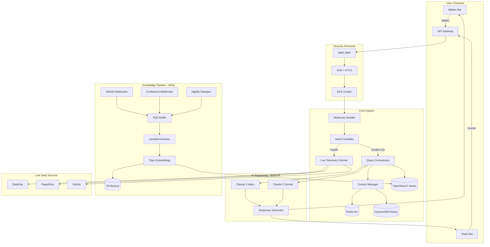

# Synapse AI SRE Assistant — Presentation README (25 min)

> A production-grade AI assistant for on-call SREs: fast context, safer actions, measurable impact.

---

## Agenda (25 min)
- Problem & stakes (1m)
- Architecture at a glance (4m)
- Guardrails & control loops (4m)
- EKS, CI/CD, rollout (4m)
- Observability & performance (4m)
- Impact, risks, roadmap (4m)
- Q&A (4m)

---

## Problem & Stakes (~1 min)
- On-call pain: high noise, long context-building, tool-hopping at 3 AM
- Goal: reduce MTTR and ticket volume via trustworthy, production-safe AI
- Constraint: zero heroics — security, cost, and reliability are first-class

---

## Architecture at a Glance (~4 min)

Key decisions
- RAG: split read (ORCH→OpenSearch) vs write (pipeline→OpenSearch)
- Cost control: 60% Haiku / 40% Sonnet routing; cache + circuit breakers
- Spike safety: SQS buffers bursts; token bucket rate limiting on APIs

See deep dive for details: [AI_SRE_ASSISTANT_README_INTERVIEW.md](./AI_SRE_ASSISTANT_README_INTERVIEW.md)

---

## Guardrails & Control Loops (~4 min)
- Policy tiers: read-only by default; action paths require explicit confirmation and safety checks
- SLO gates: canary windows, burn-rate alarms, health windows post-change
- Fallbacks: degrade gracefully — no silent failures
- Deterministic wrappers: retries, idempotency keys, bounded concurrency

Control-loop framing
- Sense: metrics/logs/traces, recent deploys, similar incidents
- Compare: error budgets, SLO targets, risk thresholds
- Act: suggest next step, or gated automation with rollbacks

---

## EKS, CI/CD, Rollout (~4 min)
- EKS Multi-AZ: autoscaling via Karpenter/Cluster Autoscaler; mTLS between services
- CI/CD: GitHub Actions → Bazel → container image → ArgoCD progressive delivery
- Feature flags: staged enablement by team/service; kill-switches
- Rollout plan: internal champions → single team → region → global

Related work for credibility
- Trustedpath Config Controller (Kubernetes operator) — config distribution at scale
  - See: [R -Trustedpath.md](./R%20-Trustedpath.md)

---

## Observability & Performance (~4 min)
- Tracing: end-to-end traces per user query (bot → ORCH → vendors)
- Metrics: p95 latency, deflection rate, resolver accuracy, cost/query
- Logging: structured, redaction by policy, correlation IDs
- Profiling: eBPF/Pyroscope harness for CPU hot spots and tail latencies
- Performance playbook: pre-warm connections, parallel fetches, cache tiers

---

## Security by Default (~2 min)
- HMAC validation at ingress; strict header casing; raw-body signature
- Mutual TLS between internal services (certs via ACM)
- Secrets Manager with local cache TTLs; rotation schedules per secret class
- Rate limiting per vendor SLA; circuit breakers and timeouts

---

## Impact, Risks, Roadmap (~4 min)
Impact (targets and examples)
- MTTR: -20–35% in P1/P2 via faster context
- Ticket deflection: 15–30% of “known issue” L1 tickets
- Cost: model routing + cache lowers spend ~20% vs naive Sonnet-only

Risks & mitigations
- Hallucination: retrieval-augmented grounding + confidence bands; never automate irreversible actions
- Vendor limits: token bucket + SQS buffering; stale-but-acceptable caches
- Security drift: rotation audits, mTLS everywhere, IAM least privilege

Roadmap
- Toolformer-style action plugins with dry-run diffs
- Broader channel support; incident timeline summarizer
- Offline eval harness and regression suite in CI

---

## Demo Storyboard (~2 min)
1) Incident starts; on-call asks: “Why auth-api 503s?”
2) Bot replies with:
   - last deploys, error spikes, similar P0s
   - runbook link and 2 next-step options
3) Follow-up: “Show CPU/GC over last 15m” → inline chart
4) Optional gated action: “Rollback latest canary?” → safety checks → ArgoCD action → confirmation

---

## Q&A (4 min)
- How do you prevent bad automation? Guardrails + human-in-the-loop + rollbacks
- What’s your eval strategy? Offline harness + live A/B + SLO watching
- How do you scale cost-effectively? Model routing, caching, SQS buffering, parallel fetches

---

## Appendix
- Full deep dive: [AI_SRE_ASSISTANT_README_INTERVIEW.md](./AI_SRE_ASSISTANT_README_INTERVIEW.md)
- Detailed system walk-through: [S -AI sre-assistant-deep-dive.md](./S%20-AI%20sre-assistant-deep-dive.md)
- Platform background & K8s operator: [R -Trustedpath.md](./R%20-Trustedpath.md)

Presenter notes
- Keep slides-to-sections pacing: ~1–2 min per section
- Use the Mermaid diagram as the visual anchor; everything else are short bullets
- If time-crunched, skip Appendix and Roadmap; preserve Guardrails + Observability
